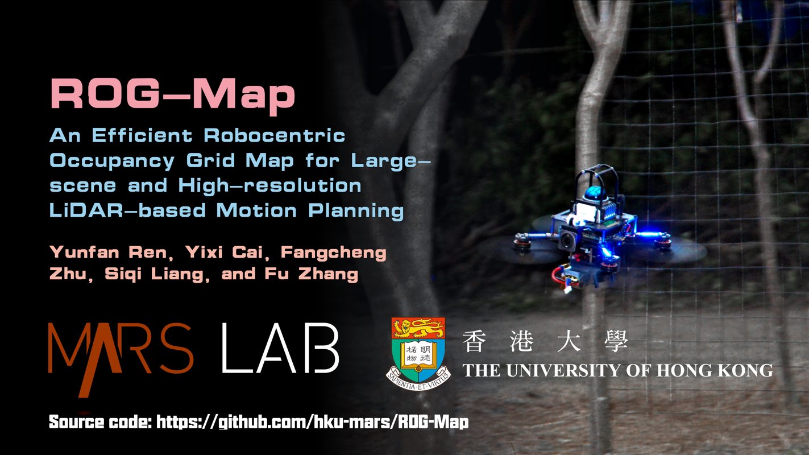
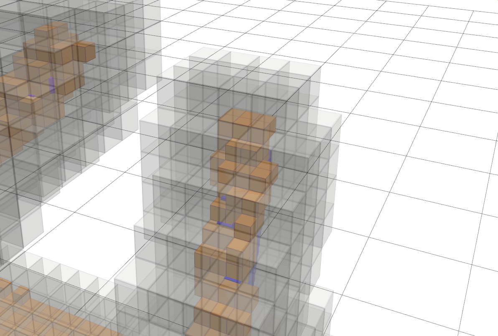
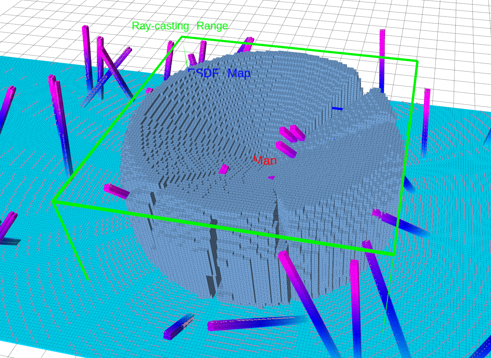
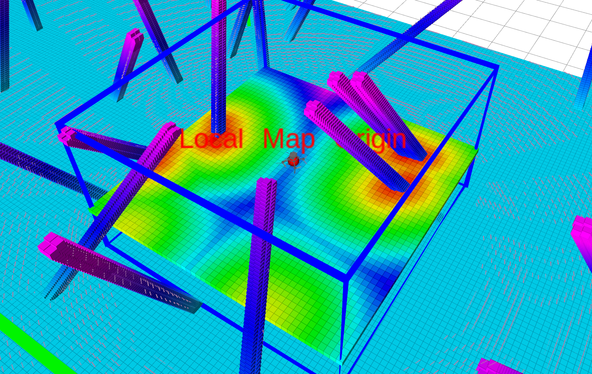
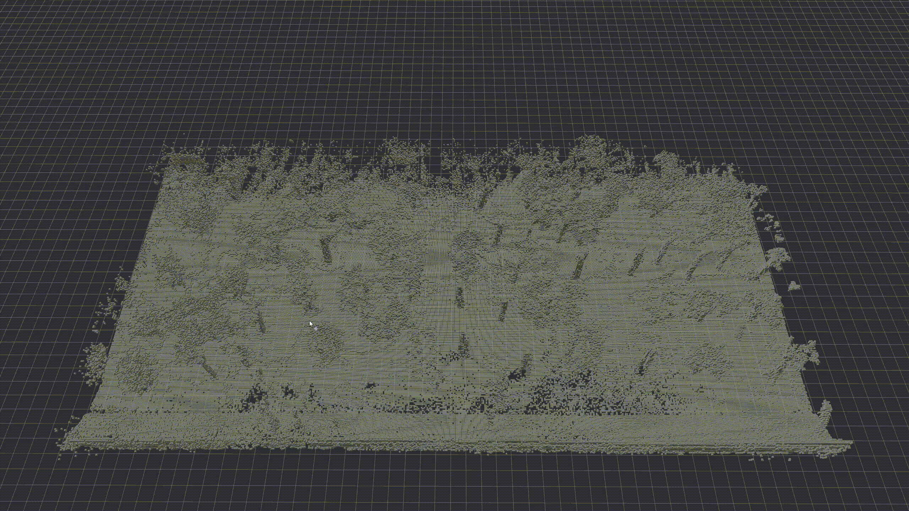

<div align="center">
    <h2>ROG-Map: An Efficient Robocentric Occupancy Grid Map for Large-scene and High-resolution LiDAR-based Motion Planning</h2>
    <strong>IROS 2024</strong>
    <br>
        <a href="https://github.com/RENyunfan" target="_blank">Yunfan REN</a>,
        <a href="https://github.com/Ecstasy-EC" target="_blank">Yixi Cai</a>,
        <a href="https://github.com/zfc-zfc" target="_blank">Fangcheng Zhu</a>,
        <a href="https://github.com/stdcat" target="_blank">Siqi Liang</a>, and
        <a href="https://mars.hku.hk/people.html" target="_blank">Fu Zhang</a>
    <p>
        <h45>
           
            <br>
        </h5>
    </p>
    <a href='https://arxiv.org/pdf/2302.14819.pdf'></a>
    <a href="https://www.bilibili.com/video/BV1wv4y1h7sa/"></a>
    <a href="https://youtu.be/eDkwGXCea7w?si=IKCW5O0otU0bObbC"></a>
</div>

## Updates

* **January 29, 2025** - The ROS2 version of ROG-Map is now available in [SUPER ](https://github.com/hku-mars/SUPER)🛸, our open-source MAV navigation system recently accepted by *Science Robotics*. Check it out!

* **Aug. 30, 2024** - Released the preview version of ROG-Map, including examples on:
  * Path planning with RRT* with [rrt_example.launch](./examples/rog_map_example/launch/rrt_example.launch) and A* algorithom with  [astar_example.launch](./examples/rog_map_example/launch/astar_example.launch)
  * Keyboard control and integration with [MARSIM](https://github.com/hku-mars/MARSIM) with [marsim_example.launch](./examples/rog_map_example/launch/marsim_example.launch)
* **Jun. 30, 2024** - Our paper was accepted by [IEEE/RSJ IROS 204](https://iros2024-abudhabi.org/)

If our repository supports your academic projects, please cite our paper. Thank you!

```
@article{ren2023rogmap,
    title={ROG-Map: An Efficient Robocentric Occupancy Grid Map for Large-scene and High-resolution LiDAR-based Motion Planning},
    author={Yunfan Ren and Yixi Cai and Fangcheng Zhu and Siqi Liang and Fu Zhang},
    journal={arXiv preprint arXiv:2302.14819},
    year={2023}
}
```

Click for the video demo.

[](https://www.youtube.com/watch?v=eDkwGXCea7w)

## Build Instructions

```bash
# install dependencies
sudo apt-get install ros-noetic-rosfmt
# for MARSIM example
sudo apt-get install libglfw3-dev libglew-dev
# Eigen [version testd: 3.3.7-2] and soft link 
sudo apt-get install libeigen3-dev       
sudo ln -s /usr/include/eigen3/Eigen /usr/include/Eigen
# dw for backward cpp
sudo apt-get install libdw-dev

mkdir -p rog_ws/src && cd rog_ws/src
git clone https://github.com/hku-mars/ROG-Map.git
cd ..
catkin_make -DBUILD_TYPE=Release
```

**Report issue**

When encountering build issues, please include the output from the version check script [./scripts/check_version.sh](./scripts/check_version.sh) when submitting your issue.

```bash
cd rog_map/scripts
bash check_version.sh
```

Example:

```
=== GCC Version ===
gcc (Ubuntu 9.4.0-1ubuntu1~20.04.2) 9.4.0
=== G++ Version ===
g++ (Ubuntu 9.4.0-1ubuntu1~20.04.2) 9.4.0
=== Eigen Version ===
Version: 3.3.7-2
```

**Known Build Issues**

- Disable the conda environment with `conda deactivate` to avoid linking issues. If you have try `catkin_make` in conda environment, please delete the `build` and `devel` and deactivate conda, and try `catkin_make` again.
- If VizCfg fails to generate, try building with `catkin_make -DCATKIN_DEVEL_PREFIX:PATH=${change-to-your-path-to-rog_ws}/devel`.
- Eigen version problem [#7](https://github.com/hku-mars/ROG-Map/issues/7), tested Eigen version: `3.3.7-2`,`3.4.1`.

## Overview

ROG-Map's three main features are **zero-copy map sliding**, **incremental map expansion**, and a **counter-based multi-resolution map**. All sub-maps and functionalities are built upon the `SlidingMap` structure. The currently open-source version includes:

- **Multi-resolution inflation maps and incremental obstacle inflation**:
  - Example: ProbMap resolution 0.1 m (yellow) with InfMap resolution 0.2 m (gray)




- **Incremental Frontier generation**
  - Example: Frontiers with a sensing range of 5m



- **Sliding ESDF map generation**

  


## Applications

### 1. Running with MARSIM

First, launch the MARSIM environment:

```bash
source devel/setup.bash # or source devel/setup.zsh
roslaunch test_interface single_drone_os128.launch
```

Then, launch the ROG-Map test node and the keyboard controller:

```bash
sudo chmod +x -R src
roslaunch rog_map_example marsim_example.launch
```

#### Control the drone with keyboard

After launching, click on the terminal running the second launch file, use the keyboard to control the drone, and observe the local sliding map:


Use `W` `A` `S` `D` on your keyboard to control the drone's velocity, press the spacebar to stop, and press `Q` orh 2 2 2 `Ctrl + C` to exit.

#### Control the drone with ROS topic

Similar to the MARSIM API, the drone can be controlled through the `/planning/pos_cmd` ROS topic, which uses the custom message type `quadrotor_msgs/PositionCommand`. 

In simulation, the drone model is idealized, meaning it will track the specified position and attitude (derived from the acceleration) with no delay. At a minimum, the following fields should be specified to control the drone:`position`,`acceleration`,` yaw`

You can try to control the drone through the script:  [call_pos_cmd.sh](./scripts/call_pos_cmd.sh) 

```bash
# 					 x y z
bash scripts/call_pos_cmd.sh 1 2 2
```

For a more realistic simulation, please refer to the original [MARSIM](https://github.com/hku-mars/MARSIM) version.

A Python example demonstrating drone control is provided in [./examples/rog_map_example/Apps/keyboard_control.py](./examples/rog_map_example/Apps/keyboard_control.py)

A similar implementation can also be created using C++.

### 2 Running A* Search Example

```bash
source devel/setup.bash # or source devel/setup.zsh
roslaunch rog_map_example astar_example.launch 
```


Then, you can press `G` to enable `3D Nav Goal` in RViz and click to select a point. Each time you select two points, ROG-Map will perform path planning between them.

You can also enable the `visualize_process_en` param at [./examples/rog_map_example/config/astar_example.yaml](./examples/rog_map_example/config/astar_example.yaml) to visualize the search process:

```yalm
astar:
  visualize_process_en: true
```


### 3 Run RRT* example

```bash
source devel/setup.bash # or source devel/setup.zsh
roslaunch rog_map_example rrt_example.launch 
```



Then, you can press `G` to enable `3D Nav Goal` in RViz and click to select a point. Each time you select two points, ROG-Map will perform path planning between them.

You can also enable the `visualize_process_en` param at [./examples/rog_map_example/config/rrt_example.yaml](./examples/rog_map_example/config/rrt_example.yaml) to visualize the sampling process:

```yalm
rrt_star:
  visualize_process_en: true
```


### TODO

- Add example for safe flight corridor generation.
- Add example for trajectory optimization.


## Using ROG-Map in Your Own ROS Project

To use ROG-Map, refer to the [rog_map_example package](./examples/rog_map_example). Here’s a basic guide:

1. Copy the `rog_map` package to your workspace and add the following dependencies in your `package.xml`:

```xml
  <build_depend>rog_map</build_depend>
  <exec_depend>rog_map</exec_depend>
```

2. Include `rog_map` in your `CMakeLists.txt`:

```cmake
find_package(catkin REQUIRED COMPONENTS
        roscpp
        std_msgs
        pcl_ros
        geometry_msgs
        nav_msgs
        rog_map # here!
)
```

3. Include `rog_map` in your source file as demonstrated in [marsim_example_node.cpp](./examples/rog_map_example/Apps/marsim_example_node.cpp)

```cpp
#include "rog_map/rog_map.h"

int main(int argc, char** argv) {
    ros::init(argc, argv, "rm_node");
    ros::NodeHandle nh("~");

    pcl::console::setVerbosityLevel(pcl::console::L_ALWAYS);

    /* 1. Creat a ROGMap ptr*/
    rog_map::ROGMap::Ptr rog_map_ptr = std::make_shared<rog_map::ROGMap>(nh);

    /* Publisher and subcriber */
    ros::AsyncSpinner spinner(0);
    spinner.start();
    ros::Duration(1.0).sleep();


    ros::waitForShutdown();
    return 0;
}
```

4. `ROG-Map` automatically reads parameters from the ROS parameter server. Ensure you load parameters in your launch file:

```xml
<launch>
    <node name="rm_node" pkg="rog_map_example" type="marsim_example_node" output="log">
        <!--        remember to load the parameters like here!! -->
        <rosparam command="load" file="$(find rog_map_example)/config/marsim_example.yaml"/>
    </node>

    <node name="keyboard_control" pkg="rog_map_example" type="keyboard_control.py" output="screen">

    </node>
</launch>
```

5. Update ROG-Map by either:

* **Using ROS topics**: 
  * Specify `odom` and `point cloud` topic name and ROG-Map will automatically update.

```yaml
rog_map:
  ros_callback:
    enable: true
    cloud_topic: "/cloud_registered"
    odom_topic: "/lidar_slam/odom"
    odom_timeout: 2.0
```

* **Manually updating**: Disable ROS topic updates in the configuration YAML:

```yaml
rog_map:
  ros_callback:
    enable: false
    cloud_topic: "/cloud_registered"
    odom_topic: "/lidar_slam/odom"
    odom_timeout: 2.0

```

Then actively update ROG-Map by calling:

```
void ROGMap::updateMap(const PointCloud& cloud, const Pose& pose);
```


## Parameters

We provide preset parameter files in [./examples/rog_map_example/config](./examples/rog_map_example/config) for your convenience. You can select and modify them as needed:

- **No raycasting, only occupied and inflated maps**: [no_raycast.yaml](./examples/rog_map_example/config/no_raycast.yaml)
- **Basic occupancy grid map with frontier generation and ESDF update disabled**: [pure_ogm.yaml](./examples/rog_map_example/config/pure_ogm.yaml)
- ...


## Acknowledgements

Special thanks to [ZJU-FAST-Lab](https://github.com/ZJU-FAST-Lab) and [HKUST Aerial Robotics Group](https://github.com/HKUST-Aerial-Robotics) for their great works.

* The MARSIM is modified from [MARSIM](https://github.com/hku-mars/MARSIM)

- The RRT* example was adapted from [ZJU-FAST-Lab's sampling-based path finding](https://github.com/ZJU-FAST-Lab/sampling-based-path-finding).
- Parts of ROG-Map and the A* example were inspired by [Ego-Planner](https://github.com/ZJU-FAST-Lab/ego-planner).
- The ESDF module was modified from [Fast-Planner](https://github.com/HKUST-Aerial-Robotics/Fast-Planner), with the addition of local map sliding functionality.
