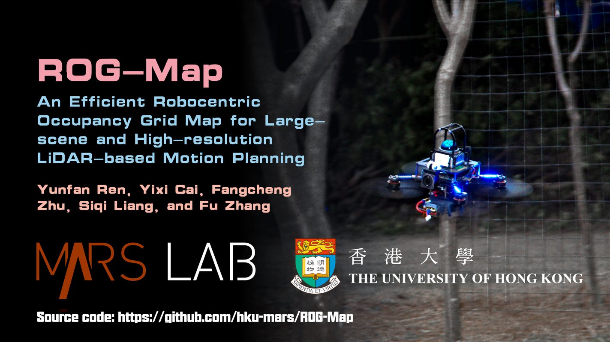

# ROG-Map

### ROG-Map: An Efficient Robocentric Occupancy Grid Map for Large-scene and High-resolution LiDAR-based Motion Planning

**Preprint**: https://arxiv.org/pdf/2302.14819.pdf

```
@misc{2302.14819,
Author = {Yunfan Ren and Yixi Cai and Fangcheng Zhu and Siqi Liang and Fu Zhang},
Title = {ROG-Map: An Efficient Robocentric Occupancy Grid Map for Large-scene and High-resolution LiDAR-based Motion Planning},
Year = {2023},
Eprint = {arXiv:2302.14819},
}
```

Click for the video demo.

[](https://www.youtube.com/watch?v=eDkwGXCea7w)

# 1 About ROG-Map

## 1.1 What can ROG-Map do?

The ROG-Map is an occupancy grid map (OGM), and all methods based on OGM can be seamlessly implemented on ROG-Map, including:

* A* path search.
* Flight corridor generation.
* Frontier generation for autonomous exploration.
* Point collision check and line segment collision check.
* Box search.
* ...

We will provide numerous examples to help you apply ROG-Map to your own projects.

## 1.2 What's the difference between existing methods?

* Using a zero-copy map sliding strategy, ROG-Map maintains only a local map near the robot, enabling it to handle large-scale scene missions in unbounded environments.
* A novel incremental inflation method significantly decreases the computation time of obstacle inflation.

## 1.3 How can I test it?

When the code is released, you can test it with
1. Run with [FAST-LIO: A computationally efficient and robust LiDAR-inertial odometry (LIO) package](https://github.com/hku-mars/FAST_LIO)
   1. Building a robocentric occupancy grid map directly using FAST-LIO as input.

2. Run with [MARSIM](https://github.com/hku-mars/MARSIM)
   1. With MARSIM, you can test your own motion planning algorithms based on ROG-Map.


# 2 Date of code release

Our paper is currently under review, and **the code of ROG-Map will be released as our work is accepted**.

